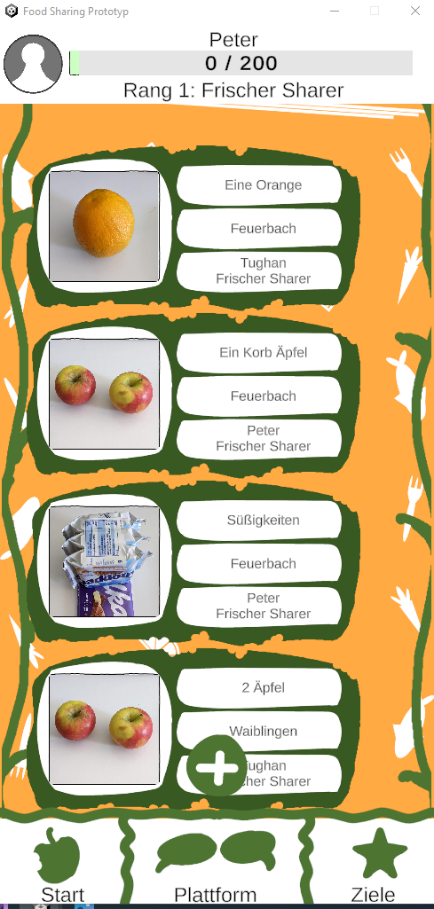
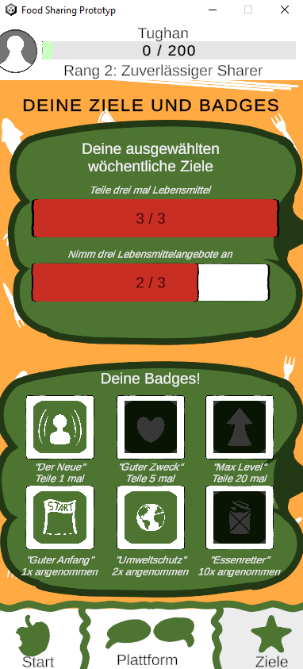
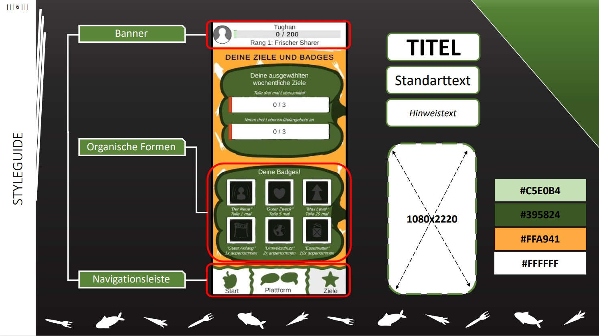
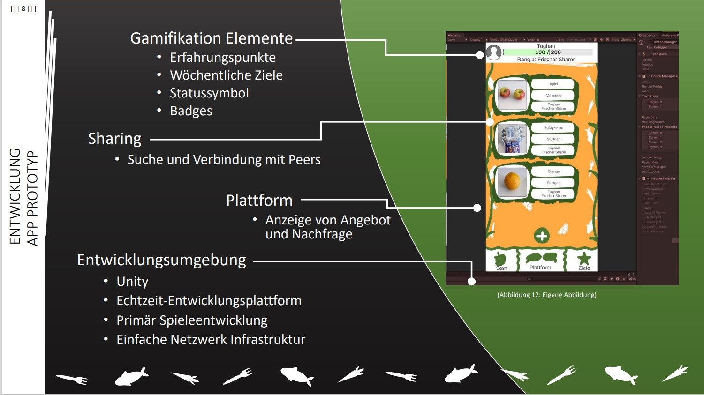

# Food-Sharing-Platform-Prototyp

This mobile application was developed as the practical component of my Bachelor thesis. It focuses on combining gamification elements with a functional peer-to-peer platform to reduce food waste.

Technical Stack: C#, Unity Engine, Real-time Networking (Netcode for GameObjects (NGO)), Android SDK

Technical Highlights:
Implemented server-authoritative logic using RPCs and NetworkVariables.
Designed a modular hub (OnlineManager) for real-time user interactions.
Created a scalable UI system in Unity.

The OnlineManager serves as the central hub for synchronized user interactions. 
It demonstrates proficiency in 
- Data integrity during item swaps and XP distribution.
- Using NetworkVariables for real-time consistency across all clients.
- Optimizing network traffic by sending data packets only to relevant clients.

### Requirements: (new commits): Unity 6000.3, (original release) Unity 2023.1.0

